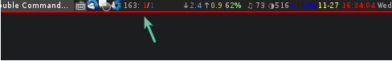

# awesome-email

## Introduction

A widget for [awesome][] to get email status.

Like this  

## Install

0.  Download this code

        git clone git@github.com:QianChenglong/awesome-email.git

0.  Copy to bin

        sudo cp ./awesome-email.py    /bin

0.  Copy and Config your email infomation in `~/.config/awesome/awesome-email.ini` 
    such as:

        [foo]
        servername: imap.foo.com
        username: foo@bar.com
        password: foobar
        ssl: Yes

0.  Config your rc.lua

        ...
        + mailWidget = fixwidthtextbox('Email')
        + mailWidgetTimer = timer({ timeout = 3 })
        + mailWidgetTimer:connect_signal("timeout", function()
        +     mailWidget:set_markup(awful.util.pread("/bin/awesome-email.py"))
        + end)
        + mailWidgetTimer:start()
        ...
        if s == 1 then right_layout:add(wibox.widget.systray()) end
        + right_layout:add(mailWidget)

[awesome]: http://awesome.naquadah.org/wiki/Main_Page
